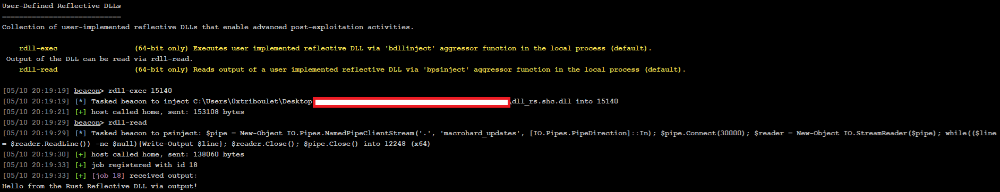

# rdll-rs

A Rust DLL template project that integrates [pe2shc](https://github.com/hasherezade/pe_to_shellcode) to facilitate the development of [Reflective DLLs](https://github.com/stephenfewer/ReflectiveDLLInjection). The template presently only supports 64-bit DLL development in most contexts, though with a few tweaks it should support 32-bit.

## Overview

rdll-rs is a Rust template that can be compiled as both a dynamic-link library (DLL), a regular executable, or a Reflective DLL. It provides an example of how to create Windows DLLs using Rust, including proper exports and Windows API integration.

## Features

- Dual compilation modes (DLL and executable)
- Windows API integration through FFI
- Example exported functions
- DLL lifecycle management

## Project Structure

- `dll/src/main.rs` - Executable entry point
- `exe/src/lib.rs` - Library implementation with DLL exports
- `build-deps/pe_to_shellcode` - Post-build stomp reflective loader
- Supporting Rust source files

## Building

To build the project, use Cargo:
```bash
cargo build
```
Or to build in release:
```bash
cargo build --release
```
Or to build a Reflective DLL:
```bash
cargo run --bin xtask --release
```

## Usage

The project can be used in thee ways:

1. As a DLL (**dll-rs.dll**):
    - Build in release mode to generate the DLL
    - The DLL exports a `DllMain` function and example functionality
2. As an executable (**debug-executable.exe**):
    - Run in debug mode to test DLL functionality without DLL debugging gymnastics
    - Running in release mode will display a warning message
    - **NOTE: For maximum compatability with this template, all functionality should be called from `dll_main` in `dll/src/lib.rs`**
3. As a Reflective DLL (**dll_rs.shc.dll**) using [@hasherezade's](https://github.com/hasherezade) [pe_to_shellcode](https://github.com/hasherezade/pe_to_shellcode)
    - Resolve submodules with `git submodule update --init --recursive`
    - `cd .\build-deps\pe_to_shellcode\`
    - `cmake .`
    - `cmake --build . --config Release`
    - `cd ..\..`
    - `cargo run --bin xtask --release`
    - Use your Reflective DLL in `target/release/dll_rs.shc.dll`
    - **NOTE: If the build process above is too complicated/broken for your taste, simply placing the [`pe2shc.exe`](https://github.com/hasherezade/pe_to_shellcode/releases/download/v1.2/pe2shc.exe) executable in the proper folder structure (`build-deps/pe_to_shellcode/pe2shc/Release/pe2shc.exe`) will work**

## Getting Reflective DLL Output to Beacon Console
This template includes a `write_output` function which allows for output via named pipes to the Beacon console (in a very hacky way).
This works by loading the `rdll-rs.cna` which registers two commands: `rdll-exec` and `rdll-read`.
- `rdll-exec` stomps the pipe name specified in the `.cna` into the `dll_rs.shc.dll`, then injects the DLL via the `bdllinject` aggressor function.
- `rdll-read` wraps the `bpsinject` aggressor function to execute a Powershell one-liner to read from the same pipe and output those contents to the beacon console.
- **NOTE: `write_output` is **BLOCKING** so it should only be used to write output to the Beacon console all at once (ie once your intended functionality is entirely complete).**



## Technical Details

- Uses `cdylib` and `rlib` crate types
- Implements Windows API bindings
- Provides internal FFI declarations for Windows types
- Includes DLL entry point handling
- Remember: For maximum compatability with this template, all functionality should be called from `dll_main` in `dll/src/lib.rs`
- Exports `ReflectiveLoader` and handles calling the real reflective loader to support legacy loader checks
- Supports the command-line ergonomics of both the `shinject` and `dllinject` commands of your [favorite C2 Framework](https://www.cobaltstrike.com/).

## Requirements

- Rust 2024 edition
- Windows operating system
- Cargo build system
- Cmake > 3.0

## Licensing

- MIT or Apache 2.0